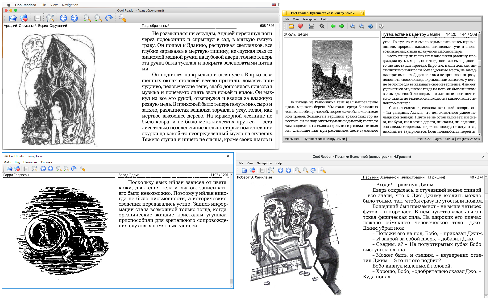

Cool Reader
===========
Cool Reader is fast and small cross-platform XML/CSS based eBook reader for desktops and handheld devices. Supported formats: FB2, TXT, RTF, DOC, TCR, HTML, EPUB, CHM, PDB, MOBI. Platforms: Windows, Linux, Android, Haiku, macOS. Ported on some eInk based devices also.

This is the [EXL](https://github.com/EXL)'s fork of the [Cool Reader](https://github.com/buggins/coolreader) program by [Vadim Lopatin](https://github.com/buggins) with addition of some patches useful for the desktop edition of application.

## Download

You can download binary builds for various operating systems from the [https://github.com/EXLMOTODEV/coolreader/releases](releases) section.

## Build instructions

See [docs/README_ORIG.TXT](docs/README_ORIG.TXT) document and AppVeyor or Travis-CI building scripts for build information.

## More information

Please read [Adding new features Manual (in Russian)](https://exlmoto.ru/cool-reader-system-fonts/) for more information about EXL's fork of the Cool Reader program. You can ask me to implement any features to application in the comments to the article by link or in the issues of this repository.
